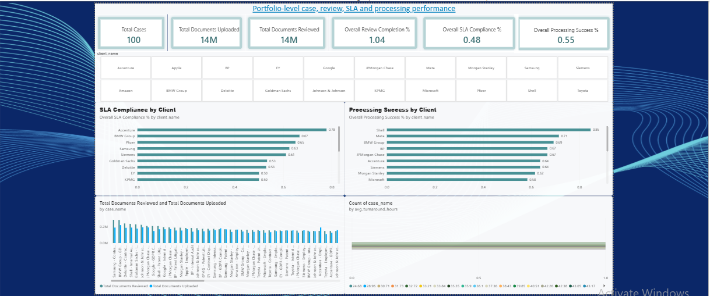
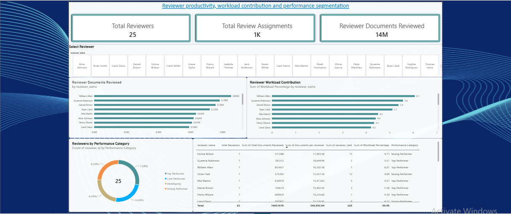
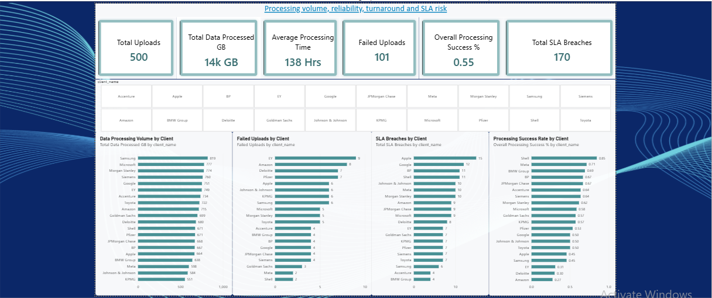

# eDiscovery Analytics & Power BI Dashboard

An end-to-end analytics portfolio project built using **PostgreSQL, SQL, Power BI, DAX, and GitHub** to simulate and analyze an eDiscovery operational environment.

The project covers the complete analytics workflow — from relational database design and SQL transformations to data-quality validation, reporting views, KPI development, and an interactive Power BI dashboard.

---

## Project Overview

eDiscovery operations generate large amounts of operational data across legal matters, custodians, data uploads, document reviews, reviewers, and service-level agreements.

The objective of this project was to build a realistic analytics solution capable of answering questions such as:

- How many documents have been uploaded and reviewed?
- What is the overall review completion rate?
- Which clients generate the highest processing workload?
- Which reviewers handle the largest document volumes?
- How is reviewer workload distributed?
- Which clients have the highest SLA breach risk?
- How reliable is the data-processing workflow?
- Which cases are related through parent-child relationships?

The final solution uses **PostgreSQL as the analytical backend** and **Power BI as the reporting and visualization layer**.

---

## Technology Stack

| Technology | Purpose |
|---|---|
| PostgreSQL | Relational database and reporting layer |
| SQL | Data transformation, analysis and validation |
| DBeaver | Database development and query execution |
| Power BI | Data modeling and dashboard development |
| DAX | KPI and analytical measure creation |
| Git | Version control |
| GitHub | Project documentation and portfolio hosting |

---

## Solution Architecture

```text
Raw / Seed Data
       ↓
PostgreSQL Database
       ↓
Relational Data Model
       ↓
SQL Transformations
       ↓
Reporting Views
       ↓
Data Quality Validation
       ↓
Power BI Data Model
       ↓
DAX Measures
       ↓
Interactive Dashboard
```

This approach separates the transactional database layer from the reporting layer instead of connecting Power BI directly to raw operational tables.

---

## Database Model

The project contains seven primary tables:

- `clients`
- `cases`
- `custodians`
- `uploads`
- `reviewers`
- `reviews`
- `sla_tracking`

The simulated environment contains:

- **100 cases**
- **500 custodians**
- **500 uploads**
- **25 reviewers**
- Document review activity
- Processing metrics
- SLA tracking information

An ER diagram and database design documentation are available in the [`docs`](docs/) directory.

---

## Case Hierarchy

A self-referencing relationship was added to the `cases` table using:

```text
parent_case_id
```

This allows related legal matters to be represented using parent-child relationships.

The hierarchy contains top-level matters and related child cases.

A **recursive CTE** was then used to traverse the hierarchy and expose the result through a reusable reporting view.

### `vw_case_hierarchy`

The view provides:

- Case ID
- Case name
- Parent case ID
- Hierarchy level

This demonstrates the use of recursive SQL for hierarchical business data.

---

## SQL Reporting Layer

Rather than performing complex transformations directly inside Power BI, reusable PostgreSQL reporting views were created.

### `vw_case_hierarchy`

Creates the parent-child case hierarchy using a recursive CTE.

### `vw_case_summary`

Provides case-level metrics including:

- Total uploads
- Documents uploaded
- Documents reviewed
- Review completion percentage
- Client information

Aggregation is performed before joining review and upload information to avoid duplicate counting.

### `vw_reviewer_performance`

Provides reviewer-level metrics including:

- Total review assignments
- Documents reviewed
- Average documents per review
- Reviewer ranking
- Workload contribution
- Performance category

Reviewer performance is segmented using:

```sql
NTILE(4)
```

The resulting categories are:

- Top Performer
- Strong Performer
- Core Performer
- Developing

This creates relative performance groups instead of relying on arbitrary fixed thresholds.

### `vw_sla_performance`

Provides operational SLA metrics including:

- Total SLA records
- SLA met
- SLA breached
- SLA in progress
- Average turnaround time
- Fastest turnaround time
- Slowest turnaround time
- SLA compliance percentage

SLA compliance is calculated using completed SLA records:

```text
SLA Met
------------------------- × 100
SLA Met + SLA Breached
```

`In Progress` records are excluded from the denominator because their final SLA outcome is not yet known.

### `vw_processing_performance`

Provides processing metrics including:

- Total uploads
- Data volume processed
- Documents uploaded
- Average processing time
- Completed uploads
- Failed uploads
- Processing uploads
- Pending uploads
- Processing success percentage

Processing success is calculated using finalized processing outcomes:

```text
Completed
-------------------- × 100
Completed + Failed
```

---

## SQL Concepts Demonstrated

The project demonstrates practical application of:

- `SELECT`
- `WHERE`
- `ORDER BY`
- `GROUP BY`
- `INNER JOIN`
- `LEFT JOIN`
- Aggregate functions
- `COUNT`
- `SUM`
- `AVG`
- `MIN`
- `MAX`
- Subqueries
- `CASE`
- Common Table Expressions
- Recursive CTEs
- Window functions
- `ROW_NUMBER`
- `RANK`
- `DENSE_RANK`
- `NTILE`
- `LAG`
- `LEAD`
- `FIRST_VALUE`
- `LAST_VALUE`
- PostgreSQL `FILTER`
- `COALESCE`
- `NULLIF`
- Views
- Foreign keys
- Self-referencing relationships
- Data-quality validation

Practice and analytical queries are available in the [`queries`](queries/) directory.

---

## Database Migrations

Database changes and reporting views are versioned through migration files.

```text
migrations/
├── 003_add_case_hierarchy.sql
├── 004_add_case_hierarchy_constraint.sql
├── 005_create_case_hierarchy_view.sql
├── 006_create_case_summary_view.sql
├── 007_create_reviewer_performance_view.sql
├── 008_create_sla_performance_view.sql
├── 009_create_processing_performance_view.sql
└── 010_update_reviewer_performance_categories.sql
```

This provides a traceable history of changes made to the database and reporting layer.

---

## Data Quality Validation

Before using the reporting layer in Power BI, SQL validation checks were performed.

The validation process checks for:

- Uploads linked to missing cases
- Reviews linked to missing uploads
- Reviews linked to missing reviewers
- NULL values in critical upload fields
- Negative data-size values
- Negative document counts
- Negative processing times
- Duplicate upload IDs
- Duplicate review IDs

The validation queries are stored in:

```text
validation/001_data_quality_checks.sql
```

The final dataset passed the defined integrity checks.

---

# Power BI Dashboard

PostgreSQL reporting views were connected to **Power BI Desktop** using Import mode.

The following reporting views form the Power BI reporting layer:

- `vw_case_summary`
- `vw_case_hierarchy`
- `vw_reviewer_performance`
- `vw_sla_performance`
- `vw_processing_performance`

Case-level relationships use `case_id`.

Reviewer Performance remains independent because its reporting grain is reviewer-level rather than case-level.

---

## Executive Overview

The Executive Overview provides a portfolio-level view of case, review, processing and SLA performance.

### Key KPIs

- Total Cases
- Total Documents Uploaded
- Total Documents Reviewed
- Overall Review Completion %
- Overall SLA Compliance %
- Overall Processing Success %

### Analysis

The page includes:

- SLA Compliance by Client
- Processing Success by Client
- Uploaded vs Reviewed Documents by Client
- Average SLA Turnaround by Client
- Interactive Client filtering



---

## Reviewer Performance

The Reviewer Performance page focuses on reviewer productivity, workload distribution and relative performance.

### Key KPIs

- Total Reviewers
- Total Review Assignments
- Documents Reviewed

### Analysis

The page includes:

- Documents Reviewed by Reviewer
- Reviewer Workload Contribution
- Reviewer Performance Category
- Reviewer ranking
- Detailed reviewer performance table
- Interactive Reviewer filtering

Performance segmentation is driven by the quartile-based classification generated in PostgreSQL.



---

## Operations & Processing

The Operations & Processing page focuses on workload, processing reliability and operational risk.

### Key KPIs

- Total Uploads
- Total Data Processed
- Average Processing Time
- Failed Uploads
- Processing Success %
- SLA Breaches

### Analysis

The page includes:

- Data Processing Volume by Client
- Failed Uploads by Client
- SLA Breaches by Client
- Processing Success Rate by Client
- Interactive Client filtering



---

## Key DAX Measures

### Total Cases

```DAX
Total Cases =
DISTINCTCOUNT('Case Summary'[case_id])
```

### Total Documents Uploaded

```DAX
Total Documents Uploaded =
SUM('Case Summary'[total_documents_uploaded])
```

### Total Documents Reviewed

```DAX
Total Documents Reviewed =
SUM('Case Summary'[total_documents_reviewed])
```

### Overall Review Completion

```DAX
Overall Review Completion % =
DIVIDE(
    [Total Documents Reviewed],
    [Total Documents Uploaded],
    0
)
```

### Overall SLA Compliance

```DAX
Overall SLA Compliance % =
DIVIDE(
    SUM('SLA Performance'[sla_met]),
    SUM('SLA Performance'[sla_met]) +
    SUM('SLA Performance'[sla_breached]),
    0
)
```

### Overall Processing Success

```DAX
Overall Processing Success % =
DIVIDE(
    SUM('Processing Performance'[completed_uploads]),
    SUM('Processing Performance'[completed_uploads]) +
    SUM('Processing Performance'[failed_uploads]),
    0
)
```

### Total Reviewers

```DAX
Total Reviewers =
DISTINCTCOUNT('Reviewer Performance'[reviewer_id])
```

### Total Review Assignments

```DAX
Total Review Assignments =
SUM('Reviewer Performance'[total_reviews])
```

### Reviewer Documents Reviewed

```DAX
Reviewer Documents Reviewed =
SUM('Reviewer Performance'[total_documents_reviewed])
```

### Total Uploads

```DAX
Total Uploads =
SUM('Processing Performance'[total_uploads])
```

### Total Data Processed

```DAX
Total Data Processed GB =
SUM('Processing Performance'[total_data_size_gb])
```

### Failed Uploads

```DAX
Failed Uploads =
SUM('Processing Performance'[failed_uploads])
```

### Total SLA Breaches

```DAX
Total SLA Breaches =
SUM('SLA Performance'[sla_breached])
```

---

## KPI Design Approach

For overall percentage KPIs, the dashboard calculates results from the underlying counts instead of averaging case-level percentages.

For example:

```text
Overall SLA Compliance =
Total SLA Met
÷
(Total SLA Met + Total SLA Breached)
```

This produces a properly weighted portfolio-level KPI.

The same approach is used for overall processing success.

---

## Business Questions Answered

The completed analytics solution can answer questions such as:

- Which clients generate the highest processing workload?
- Which clients have the highest SLA breach volume?
- Which clients have the strongest and weakest processing success rates?
- How much data is being processed across the portfolio?
- How many uploaded documents have been reviewed?
- What is the overall review completion rate?
- Which reviewers process the highest document volumes?
- How is reviewer workload distributed across the team?
- Which reviewers fall into the highest performance quartile?
- How reliable is the processing workflow?
- Where are operational SLA risks concentrated?

---

## Repository Structure

```text
ediscovery-analytics/
│
├── dashboard/
│   └── README.md
│
├── data/
│   ├── sample_data.csv
│   └── seed_data.sql
│
├── docs/
│   ├── database_design.md
│   └── er_diagram.png
│
├── migrations/
│   ├── 003_add_case_hierarchy.sql
│   ├── 004_add_case_hierarchy_constraint.sql
│   ├── 005_create_case_hierarchy_view.sql
│   ├── 006_create_case_summary_view.sql
│   ├── 007_create_reviewer_performance_view.sql
│   ├── 008_create_sla_performance_view.sql
│   ├── 009_create_processing_performance_view.sql
│   └── 010_update_reviewer_performance_categories.sql
│
├── powerbi/
│   └── ediscovery_analytics_dashboard.pbix
│
├── queries/
│   ├── 01_basic_queries.sql
│   ├── 02_joins.sql
│   ├── 03_aggregations.sql
│   ├── 04_subqueries.sql
│   ├── 05_cte.sql
│   ├── 06_window_functions.sql
│   ├── 07_views.sql
│   ├── 08_indexes.sql
│   ├── 09_business_questions.sql
│   └── 10_dashboard_queries.sql
│
├── schema/
│   ├── alter_reviewers_add_user_id.sql
│   └── schema.sql
│
├── screenshots/
│   ├── executive_overview.png
│   ├── operations_processing.png
│   └── reviewer_performance.png
│
├── validation/
│   └── 001_data_quality_checks.sql
│
├── LICENSE
└── README.md
```

---

## Power BI File

The complete Power BI Desktop report is available at:

```text
powerbi/ediscovery_analytics_dashboard.pbix
```

The screenshots above allow the dashboard to be previewed directly from GitHub without requiring Power BI Desktop.

---

## Key Learning Outcomes

This project strengthened practical experience in:

- Relational database design
- PostgreSQL development
- SQL joins and aggregations
- Common Table Expressions
- Recursive queries
- Window functions
- Ranking and segmentation
- Data validation
- Reporting-layer architecture
- Power BI data modeling
- DAX measure development
- Weighted KPI calculations
- Dashboard design
- Business-oriented data analysis
- Git-based version control

---

## Future Enhancements

Potential future enhancements include:

- Date-based trend reporting
- Monthly SLA performance analysis
- Processing-volume trends
- Reviewer productivity trends
- Power BI drill-through pages
- Dynamic KPI targets
- Automated refresh workflows
- Additional operational alerting

---

## Author

**Anish Ranjan**

Built as a hands-on portfolio project demonstrating practical experience with **PostgreSQL, SQL, Power BI, DAX, data modeling, reporting, and business analytics**.
